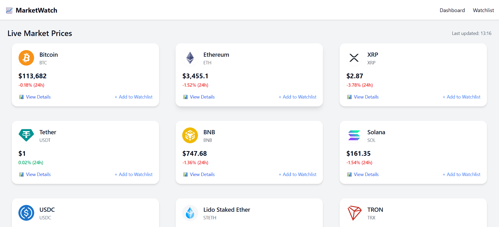
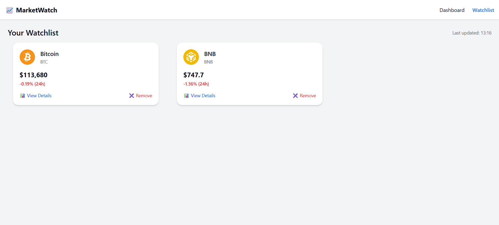
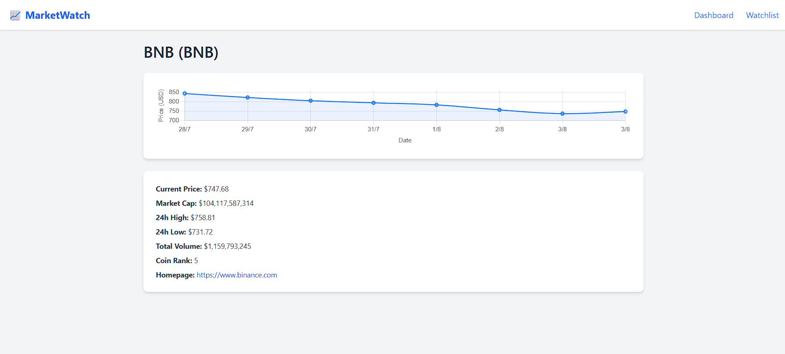

# 📈 MarketWatch – Real-Time Stock & Crypto Tracker

A modern, responsive, and fully frontend-based stock and cryptocurrency tracking dashboard built using **HTML**, **Tailwind CSS**, **JavaScript**, and **Chart.js**.  
MarketWatch offers **live market prices**, **interactive charts**, **watchlist management**, and **trend analysis**—all powered by the **CoinGecko API** with localStorage-based persistence and seamless UI experience.

---

## ⚙️ Project Structure

- `index.html` – 📊 Dashboard with live price data for top coins
- `watchlist.html` – ⭐ Watchlist page (Add/remove coins to favorites)
- `details.html` – 📉 Detailed chart and metrics for individual coins
- `style.css` – 🎨 Tailwind CSS styling and dark mode support
- `script.js` – ⚡ Main logic: data fetch, render, interaction handling

---

## ✨ Features

### 🖥️ Dashboard (index.html)
- ✅ Fetches live market data (name, price, symbol, change %, volume, rank)
- ✅ Refreshes data every 60 seconds
- ✅ Fully responsive Tailwind-based layout
- ✅ Search bar to filter by coin name or symbol
- ✅ Rank, price, 24h % change with color indicators
- ✅ Add/remove from Watchlist (🔖 icon)

### ⭐ Watchlist (watchlist.html)
- ✅ Displays only user-favorited coins
- ✅ Data persists using localStorage
- ✅ Can remove coins directly from this view
- ✅ Uses the same UI and dark mode styling as dashboard

### 📉 Details Page (details.html)
- ✅ Coin-specific historical price chart using Chart.js
- ✅ Multi-range selector: 1D, 7D, 30D, 90D
- ✅ Displays metadata (Rank, Volume, Market Cap, Symbol)
- ✅ Error handling for unknown or invalid coin IDs
- ✅ Responsive chart layout and dark mode integration

---

## 📸 Screenshots

> 💻 Dashboard View  

> ⭐ Watchlist Page  

> 📊 Details Page  

---

## 🚀 Live Demo

🔗 [Explore the Live MarketWatch App on GitHub Pages](https://Pranay3034.github.io/MarketWatch/)

---

## 🛠️ Built With

- 🧱 **HTML5** – Markup and structure  
- 🎨 **Tailwind CSS** – Modern and responsive styling  
- ⚙️ **JavaScript (Vanilla)** – API fetch, localStorage, interactivity  
- 📊 **Chart.js** – Historical price charts  
- 📡 **CoinGecko API** – Public crypto data API  
- 🌘 **LocalStorage** – Dark mode + watchlist persistence  

---

## 🙌 Acknowledgements

Made with ❤️ as part of a frontend internship task.  
Special thanks to:
- [Bootstrap](https://getbootstrap.com)
- [Font Awesome](https://fontawesome.com)
- The open-source community on [GitHub](https://github.com)

---

## 📬 Contact

Let’s connect and grow:

- 🔗 [LinkedIn – Pranay Gedam](https://www.linkedin.com/in/pranay-gedam-b86a0a339/)
- 🐙 [GitHub – @Pranay3034](https://github.com/Pranay3034)

---

> ⚡ Feel free to fork, use, or improve this project. Feedback is always welcome!
